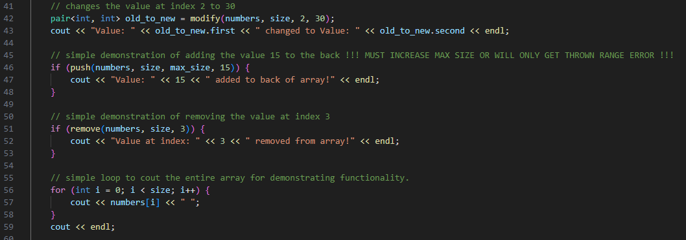
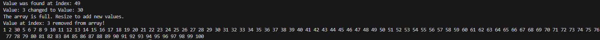

# Comp-Sci 303 - Assignment 1

This is a simple program that reads a list of numbers given from an input file and adds them to the array. It allows various functions such as adding, removing, editing, and searching.

The function declarations can be found in the assignment_1.h Header file.

The function definitions can be found in the assignment_1.cpp file

In order to run the code you can use a compiler of your choice to compile the code in the main.cpp file and run it with the example input given below.

## Example Input

## Example Output

